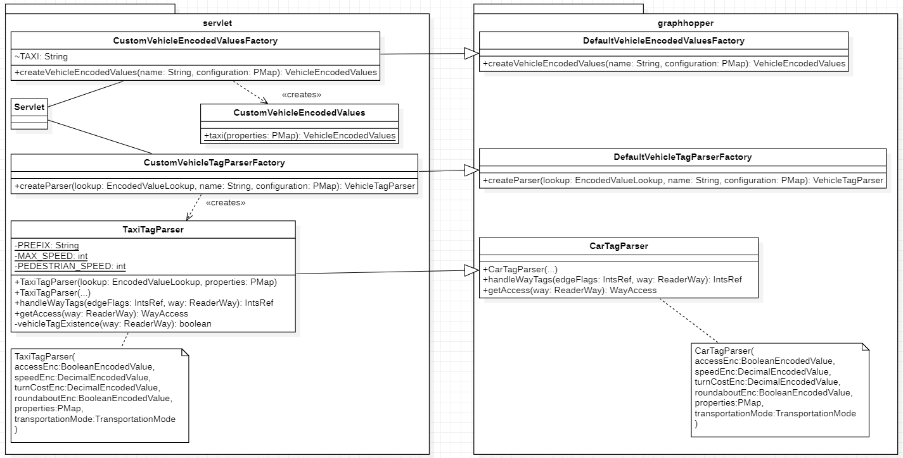

# Dynamic constrained routing with traffic data

This project aims to extend the GraphHopper routing engine to support dynamic constraints.
The main use case is to route vehicles through a road network, including blocked areas and optionally considering the traffic data to weight the map edges.

It uses a **typical time trend** in order to get the traffic density of each edge, and uses these values to calculate the best path.

This also supports the specification of areas to avoid during navigation, called **blocked areas**.

## How to use

The project is a Maven project.
In order to install the dependencies you can use the following command:

```bash
mvn clean install
```

It is possible to compile and package the project with the following command:

```bash
mvn package
```

This will create a `.war` file in the `target` folder.

## How to run

### Docker Container
Fill in the environment and volume vars and run the container.

## Logging
A logging system can be used decommenting LOGGING part in pom.xml

## Code structure

The code is described by the following class diagram:




The main class is the `Servlet.java` class.
It is a Jersey servlet that can be deployed in a servlet container (e.g. Tomcat).

The servlet uses the following classes:

- `DynamicGraphHopper`: it extends the `GraphHopper` class to support dynamic constraints. It uses the
  `DynamicOSMReader` class to read the OSM file and create a mapping between the OSM way IDs and the GraphHopper's Edge IDs. This class has a *Factory method* (`createWeightingFactory()`) to create the **WeightingFactory** to use to create the **Weighting** for each edge, for example a `FastestWeightingWithTraffic`. It also reads the historical traffic data from some JSON files.
- `DynamicOSMReader`: it extends the `OSMReader` class in order to take note of the mapping between the OSM way IDs and the GraphHopper's Edge IDs.
- `FastestWeightingWithTraffic`: it extends the `FastestWeighting` class to support the traffic data. It calculates the time needed to traverse an edge considering the traffic data, following the **Greenshield's model**.
- `CustomVehicleTagParserFactory`: it extends the `DefaultVehicleTagParserFactory` class of **GraphHopper**. This class override parent factory method `createParser(EncodedValueLookup lookup, String name, PMap configuration)`.
It defines how OSM tags are parsed and converted into the encoded values defined by `VehicleEncodedValues`.
- `TaxiTagParser`: the concrete *VehicleTagParser* class, it extends *CarTagParser*. Extends the behavior of a *Car* and can access to preferential and emergency lanes, even in a pedestrian context.
- `CustomVehicleEncodedValuesFactory`: it extends the `DefaultVehicleEncodedValuesFactory` class of **GraphHopper**. This class override parent factory method `createVehicleEncodedValues(String name, PMap configuration)`.
It defines and provides the data structure and values needed to represent various vehicle-specific routing properties.
- `CustomVehicleEncodedValues`: class needed to store new vehicles' `VehicleEncodedValues` properties.

### How does the code block certain areas?

The `DynamicGraphHopper` class has a `setBlockArea()` method that can be used to block certain areas, and uses the default `BlockAreaWeighting` class to block the areas, that wraps the chosen `Weighting` (e.g. create a `FastestWeightingWithTraffic` and wrap it with a `BlockAreaWeighting`).

### How to add new vehicle

This is a basic guide to add a new vehicle to this project. It is based on [this GitHub pull request](https://github.com/graphhopper/graphhopper/pull/2710/commits/430d85da65554871b73a2439eb0581f69ea6adfa).
Firstly create a static method in `CustomVehicleEncodedValues` that returns the `VehicleEncodedValues` data for the new vehicle. Use *VehicleEncodedValues* class to get 'inspiration'. Add this to its factory (`CustomVehicleEncodedValuesFactory`).
Then create the concrete *VehicleTagParser* class, extending the correct existing vehicle *TagParser* or creating a new one. Then add the object to its factory (`CustomVehicleTagParserFactory`).

## API specification

The servlet only has the `/route` endpoint that accepts HTTP GET requests.
The request can have the following parameters:

- `vehicle`: the vehicle profile to use (e.g. `vehicle=car`).
Possible values:
  - `car` (Default)
  - `roads`
  - `bike`
  - `racingbike`
  - `mtb` i.e. mountainbike
  - `foot`
  - `hike`
  - `motorcycle`
  - `wheelchair`
  - `taxi`
- `waypoints`: a list of waypoints separated by `;` (e.g. `waypoints=lon1,lat1;lon2,lat2;lon2,lat2`), where `lat` and `lon` are the latitude and longitude of the waypoint. The first waypoint is the start point, the last waypoint is the end point, and the others are the intermediate points.
- `avoid_area`: areas to avoid during navigation. It should be specified as a JSON, and it should be a **FeatureCollection** that can contain different shapes: `Polygon`, `Circle`, `BBox`, `Point`.
    - Default: empty
- `startDateTime`: the start date and time of the route. It should be specified as a string in the format `yyyy-MM-dd'T'HH:mm:ss`.
    - Default: current date and time
- `weighting`: the weighting to use for the route calculation. 
Possible values:
    - `fastest` (Default)
    - `shortest`
    - `short_fastest`
    - `fastest_with_traffic`
    - `custom` (not a possible value; case not detailed at the moment)

The response is a JSON with a list of instructions to follow to reach the destination.
The instructions are the same as the ones returned by GraphHopper, and contain the following fields:

- `text`: description of the instruction
- `street_name`: the name of the street
- `time`: the time needed
- `distance`: the distance to cover
- `sign`
- `interval`
- ... other extra info

## Custom Vehicle specification

### Taxi
Taxi is a vehicle profile that behaves like a car about road types where can circulate. Extends car behavior using emergency and psv lanes, that normally are forbidden for car profile.
- `MAX_SPEED` attribute defines the maximum allowed speed, *100km/h*.
- `PEDESTRIAN_SPEED` attribute defines the speed in pedestrian context, *30km/h*.

In constructor some car constrains are modified, eg:
```java
restrictions.remove("motorcar");
```
***Removes*** *"motorcar"* from the list of tags the parser considers when checking vehicle access restrictions.
```java
restrictedValues.remove("private");
```
***Removes*** *"private"* from the list of tags the parser considers when checking road access restrictions.
```java
barriers.remove("bus_trap");
```
***Removes*** *"bus_trap"* from the list of tags the parser considers when checking barrier type restrictions.

Two methods are needed to be overridden:
- `public WayAccess getAccess(ReaderWay way)`: determines whether a vehicle is allowed to travel on a specific OSM way based on its tags. It adds the access to emergency lanes (defined with tags *emergency:yes* and *service:emergency_access*) and pedestrian emergency, psv and taxi lanes, tagged respctively *highway=pedestrian*, *psv=yes*, *emergency=yes*, *taxi=yes*.
- `public IntsRef handleWayTags(IntsRef edgeFlags, ReaderWay way)`: encodes detailed edge information like directional access, speed, and other flags, based on OSM tags. Update the edge access and speed data for the pedestrian context (both directions) and allow using road tagged *lanes:psv:backward* in opposite direction.
This last case, reported in the drawing below, means that the only direction represent in the osm data is the car lane one but in reality exists the preferential lane in the opposite direction. 
An example could be [Via Giovanni dalle Bande Nere](https://www.openstreetmap.org/way/172556868).
```text
==========================
 <----------bus lane-----
——————————————————————————
 -----car lane---------->
==========================
```
The try catch block is to ensure that the super *handleWayTags* method not fails with the new roads that are normally forbidden.