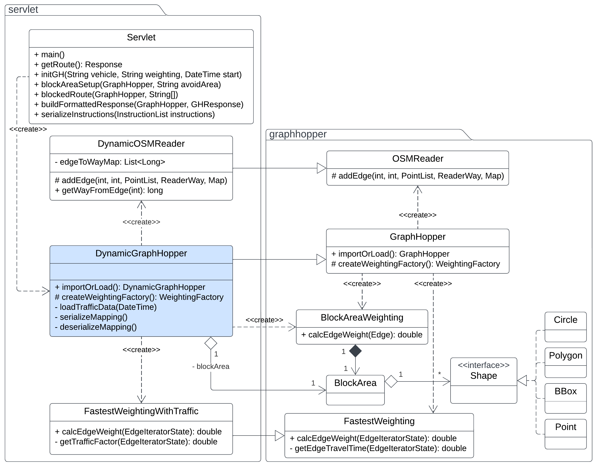

# Dynamic constrained routing with traffic data

This project aims to extend the GraphHopper routing engine to support dynamic constraints.
The main use case is to route vehicles through a road network, including blocked areas and optionally considering the
traffic data to weight the map edges.

It uses a **typical time trend** in order to get the traffic density of each edge, and uses these values to calculate
the best path.

This also supports the specification of areas to avoid during navigation, called **blocked areas**.

## How to use

The project is a Maven project.
In order to install the dependencies you can use the following command:

```bash
mvn clean install
```

It is possible to compile and package the project with the following command:

```bash
mvn package
```

This will create a `.war` file in the `target` folder.

## Code structure

The code is described by the following class diagram:



The main class is the `Servlet.java` class.
It is a Jersey servlet that can be deployed in a servlet container (e.g. Tomcat).

The servlet uses the following classes:

- `DynamicGraphHopper`: it extends the `GraphHopper` class to support dynamic constraints. It uses the
  `DynamicOSMReader` class to read the OSM file and create a mapping between the OSM way IDs and the GraphHopper's
  Edge IDs. This class has a *Factory method* (`createWeightingFactory()`) to create the **WeightingFactory** to use to
  create the **Weighting** for each edge, for example a `FastestWeightingWithTraffic`. It also reads the historical
  traffic data from some JSON files
- `DynamicOSMReader`: it extends the `OSMReader` class in order to take note of the mapping between the OSM way IDs
  and the GraphHopper's Edge IDs
- `FastestWeightingWithTraffic`: it extends the `FastestWeighting` class to support the traffic data. It calculates
  the time needed to traverse an edge considering the traffic data, following the **Greenshield's model**

### How does the code block certain areas?

The `DynamicGraphHopper` class has a `setBlockArea()` method that can be used to block certain areas, and uses the
default `BlockAreaWeighting` class to block the areas, that wraps the chosen `Weighting` (e.g. create
a `FastestWeightingWithTraffic` and wrap it with a `BlockAreaWeighting`).

## API specification

The servlet only has the `/route` endpoint that accepts HTTP GET requests.
The request can have the following parameters:

- `vehicle`: the vehicle profile to use (e.g. `vehicle=car`). The possible values are the ones supported by GraphHopper
    - Default: `car`
- `waypoints`: a list of waypoints separated by `;` (e.g. `waypoints=lat1,lon1;lat2,lon2;lat3,lon3`), where `lat`
  and `lon` are the latitude and longitude of the waypoint. The first waypoint is the start point, the last waypoint is
  the end point, and the others are the intermediate points
- `avoid_area`: areas to avoid during navigation. It should be specified as a JSON, and it should be a *
  *FeatureCollection**
  that can contain different shapes: `Polygon`, `Circle`, `BBox`, `Point`.
    - Default: empty
- `startDateTime`: the start date and time of the route. It should be specified as a string in the format
  `yyyy-MM-dd'T'HH:mm:ss`
    - Default: current date and time
- `weighting`: the weighting to use for the route calculation. The possible values are the ones supported by
  GraphHopper, with the adding of `fastest_with_traffic`.
    - Default: `fastest`

The response is a JSON with a list of instructions to follow to reach the destination.
The instructions are the same as the ones returned by GraphHopper, and contain the following fields:

- `text`: description of the instruction
- `street_name`: the name of the street
- `time`: the time needed
- `distance`: the distance to cover
- `sign`
- `interval`
- ... other extra info

